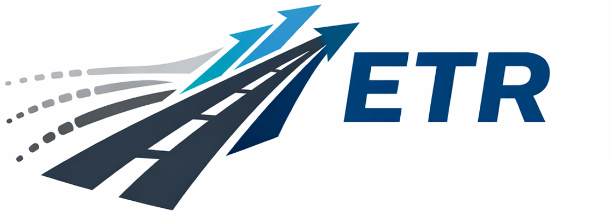

#  ETR: Entropy Trend Reward for Efficient Chain-of-Thought Reasoning

## Environment Setup
We utilized VeRL's provided official docker image.
### Step 1: Clone the verl repository
the specific commit we are using is cf619d68d4b15c736ff62c26cd16739c81556e94. So,
```bash
git clone https://github.com/volcengine/verl && cd verl
git checkout cf619d68d4b15c736ff62c26cd16739c81556e94
```
### Step 2: Install Docker Image
#### 1. Pull the specific docker image
First, download the pre-configured environment:
```bash
docker pull verlai/verl:app-verl0.5-transformers4.55.4-vllm0.10.0-mcore0.13.0-te2.2
```
#### 2. Create the container
```bash
docker create --runtime=nvidia --gpus all --net=host --shm-size="10g" \
    --cap-add=SYS_ADMIN -v <your_local_verl_path>:/workspace/verl \
    --name verl \
    verlai/verl:app-verl0.5-transformers4.55.4-vllm0.10.0-mcore0.13.0-te2.2 \
    sleep infinity
# Start the container
docker start verl
# Enter the container
docker exec -it verl bash
```

#### 3. Once you are inside the container shell, install the verl package in editable mode without reinstalling dependencies:
```bash
cd verl
pip3 install --no-deps -e .
```

## Data Preparation
Our training data consists of 7,000 problems randomly sampled from DeepMath-103K. You can run the following command to generate the data:
```bash
python deepmath_subset.py
```
## Training
**Follow these steps to integrate ETR into the veRL framework:**
```bash
# Add Reward
cp deepmath.py /path/to/verl/verl/utils/reward_score/

# Replace __init__.py to import our reward
cp __init__.py /path/to/verl/verl/utils/reward_score/__init__.py

# Replace vllm rollout file
cp vllm_rollout_spmd.py /path/to/verl/verl/workers/rollout/vllm_rollout/vllm_rollout_spmd.py

# Replace naive reward manager
cp naive.py /path/to/verl/verl/workers/reward_manager/naive.py

# Add training script
cp deepmath.sh /path/to/verl/examples/grpo_trainer
```
**Launch Training**

The exact training script we used is ```deepmath.sh```, you can launch the training by using:
```bash
bash deepmath.sh
```
## Evaluation
We use SGLang framework to generate responses from the models.
```bash
CUDA_VISIBLE_DEVICES=0,1 \
python -m sglang.launch_server \
  --model <your_model_path> \
  --host 0.0.0.0 \
  --port 42000 \
  --dtype bfloat16 \
  --tp 1 \
  --mem-fraction-static 0.9
```
Then you can go to the ```eval``` folder and start the evaluation
``` 
cd eval
python eval.py 
---model_path <your_model_path>
--benchmark amc23  # Available benchmarks [amc23, aime24, gpqa, math500]
--port 42000
```
